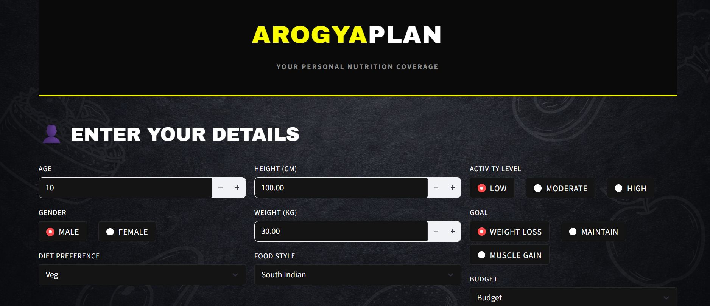
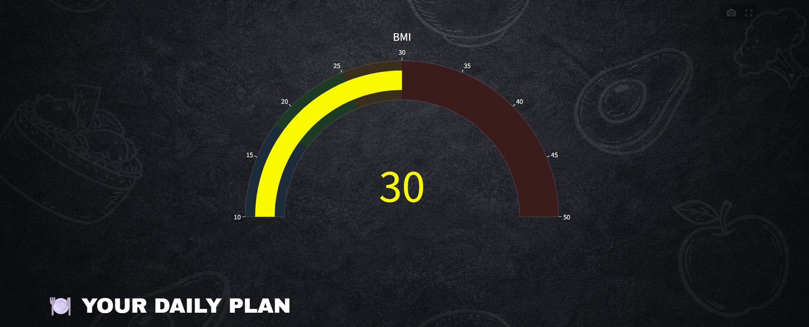

<div align="center">


<br/>

[](https://python.org)
[](https://streamlit.io)
[](https://scikit-learn.org)
[](https://pandas.pydata.org)
[](https://plotly.com)

<br/>

> **Analyze health metrics → Predict your ideal diet → Live better.**
>
> An end-to-end machine learning system that recommends a personalized diet plan
> based on your BMI, sugar levels, cholesterol, activity, and fitness goals.

<br/>

[Problem](#problem-statement) · [ML Workflow](#ml-workflow) · [Features](#input-features) · [Diet Plans](#predicted-diet-classes) · [Model](#model-details) · [Setup](#installation-guide) · [Author](#author)

</div>

---

## Problem Statement

Most diet plans fail because they are **generic** — built for the average person, not for *you*.

Two people with the same weight-loss goal can need completely different nutrition strategies depending on age, activity level, blood sugar, and cholesterol. **Arogya Plan AI** solves this by training a K-Nearest Neighbors model on health profiles to match users with their most suitable diet category.

| Without Arogya Plan AI | With Arogya Plan AI |
|---|---|
| Generic meal plans | Personalized to your exact health profile |
| Ignores medical indicators | Sugar & cholesterol-aware |
| Same advice for everyone | Goal-specific: Loss / Maintain / Gain |
| Manual guesswork | Instant ML-powered prediction |

---

## ML Workflow

```
User Health Input
       │
       ▼
┌──────────────────────────┐
│   Feature Engineering    │  BMI calc · encode gender, activity, goal
└──────────────────────────┘
       │
       ▼
┌──────────────────────────┐
│   KNN Model  (model.pkl) │  Finds k most similar health profiles
└──────────────────────────┘
       │
       ▼
┌──────────────────────────┐
│  Diet Plan Recommendation│  Breakfast · Lunch · Dinner + visualizations
└──────────────────────────┘
       │
       ▼
  Personalized Result
```

### Why KNN?

- **Similarity-based** — naturally suited to recommendation and personalization problems
- **Interpretable** — easy to explain "similar users eat this" to non-technical stakeholders
- **No distribution assumptions** — non-parametric, flexible for health data
- **Fast inference** — real-time predictions suitable for a live web app

---

## Input Features

| # | Feature | Type | Description |
|---|---|---|---|
| 1 | Age | Numeric | User age (years) |
| 2 | Gender | Categorical | Male → 0, Female → 1 |
| 3 | Height | Numeric | In centimetres |
| 4 | Weight | Numeric | In kilograms |
| 5 | BMI | Derived | Auto-calculated: weight / (height/100)² |
| 6 | Activity Level | Categorical | Low → 0, Moderate → 1, High → 2 |
| 7 | Sugar Level | Numeric | Blood sugar reading |
| 8 | Cholesterol | Numeric | Cholesterol level |
| 9 | Goal | Categorical | Weight Loss → 0, Maintain → 1, Muscle Gain → 2 |

---

## Predicted Diet Classes

The trained KNN model predicts one of five categories:

| Class | Diet Plan | Recommended For |
|---|---|---|
| 0 | Low Carb Diet | Active users targeting fat loss |
| 1 | Diabetic Diet | High sugar levels or diabetic profiles |
| 2 | Heart Healthy Diet | Elevated cholesterol, cardiovascular focus |
| 3 | Balanced Diet | General maintenance and healthy living |
| 4 | High Protein Diet | Muscle gain and strength goals |

---

## Model Details

| Parameter | Value |
|---|---|
| Algorithm | K-Nearest Neighbors |
| Feature Selection | Backward Sequential (5 features retained) |
| Final Features | BMI · Activity Level · Sugar Level · Cholesterol · Goal |
| Resampling | SMOTE (`k_neighbors=5`) |
| Best K | 3 |
| Distance Metric | Manhattan |
| Weight Function | Distance-weighted |
| Hyperparameter Search | GridSearchCV over 5-fold StratifiedKFold |

Correlation analysis showed Age, Gender, Height, and Weight had weak predictive signal for diet category — dropping them and keeping the top 5 features noticeably improved model accuracy, a good example of feature engineering paying off in practice.

---

## App Preview

<p align="center">

</p>
<p align="center"><i>Input screen — dark, sports-app-inspired UI for entering health details.</i></p>

<p align="center">

</p>
<p align="center"><i>Results view — BMI gauge and personalized daily plan.</i></p>

---

## App Features

Built with Streamlit, the app delivers a polished, responsive experience:

- **Dark, sports-app-inspired UI** with a bold accent color
- **BMI Gauge Chart** — real-time Plotly gauge with colour-coded health zones
- **KPI Metrics** — BMI, sugar, and cholesterol displayed as quick-read cards
- **Daily Meal Cards** — Breakfast, Lunch, Dinner, Snacks, and Drinks for the recommended diet
- **Calories Overview Chart** — estimated calorie breakdown per meal
- **Try Again** — reset and re-run with new inputs without refreshing
- **Session state management** — smooth two-screen flow (input → results)

---

## Installation Guide

**Prerequisites:** Python 3.10+, pip

```bash
# 1. Clone the repository
git clone https://github.com/kiranalamuri/diet-recommendation.git
cd diet-recommendation

# 2. Install dependencies
pip install -r requirements.txt

# 3. Run the app
streamlit run app.py
```

Open `http://localhost:8501` in your browser.

> **Note:** The trained model file must be present at `model/model.pkl`. Run the KNN notebook first if you need to regenerate it.

---

## Project Structure

```text
diet-recommendation/
│
├── .streamlit/
│   └── config.toml                    # Streamlit configuration
│
├── Source/
│   └── diet_recommendation_dataset_1000.xls   # Dataset file
│
├── assets/
│   ├── images/
│   │   └── bg1.png                    # Background UI image
│   └── screenshots/
│       ├── input-form.png
│       └── bmi-gauge.png
│
├── model/
│   └── model.pkl                      # Trained KNN model
│
├── Data Cleaning + EDA.ipynb
├── Diet Recommendation Using KNN Algorithm.ipynb
│
├── app.py
├── requirements.txt
├── README.md
└── .gitignore
```

---

## Tech Stack

| Layer | Technology |
|---|---|
| Language | Python 3.10 |
| Data Processing | Pandas, NumPy |
| Machine Learning | Scikit-learn (KNN) |
| Web App | Streamlit |
| Visualizations | Plotly |
| UI Styling | Custom HTML + CSS |
| Model Storage | Pickle (.pkl) |

---

## Author

<div align="center">

**Kiran Alamuri**

[](https://github.com/kiranalamuri)

</div>

---

<div align="center">

**Built with ❤️ for healthier living**


</div>
